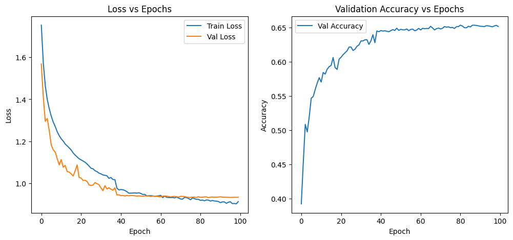

# Emotion Detector using CNN

This repository contains a Convolutional Neural Network (CNN) based **Emotion Detection** system trained on facial images. The model is implemented from scratch and is designed to classify facial expressions into seven categories.

---

## Project Overview

* **Goal:** Detect emotions from facial images.
* **Classes:** 7 emotions (e.g., happy, sad, angry, surprise, neutral, disgust, fear)
* **Dataset:** FER2013 (Facial Expression Recognition)
* **Model:** Custom CNN (from scratch)

---

## Model Architecture

The CNN architecture consists of:

* **Feature Extractor:**

  * 4 convolutional blocks with Batch Normalization and ReLU
  * MaxPooling layers after some convolutional blocks
  * Final block has 264 channels and feature map size 3x3

* **Classifier:**

  * Fully connected layers: 264*3*3 → 256 → 7
  * Dropout layers for regularization (0.4)

* **Input:** Grayscale images of size 48x48 (1 channel)

**PyTorch Model Definition:**

```python
class ScratchCNN(nn.Module):
    def __init__(self, num_classes=7):
        super(ScratchCNN, self).__init__()
        self.features = nn.Sequential(
            nn.Conv2d(1, 32, 3, padding=1),
            nn.BatchNorm2d(32),
            nn.ReLU(inplace=True),
            nn.Conv2d(32, 32, 3, padding=1),
            nn.BatchNorm2d(32),
            nn.ReLU(inplace=True),
            nn.MaxPool2d(2),
            nn.Conv2d(32, 64, 3, padding=1),
            nn.BatchNorm2d(64),
            nn.ReLU(inplace=True),
            nn.Conv2d(64, 64, 3, padding=1),
            nn.BatchNorm2d(64),
            nn.ReLU(inplace=True),
            nn.MaxPool2d(2),
            nn.Conv2d(64, 128, 3, padding=1),
            nn.BatchNorm2d(128),
            nn.ReLU(inplace=True),
            nn.MaxPool2d(2),
            nn.Conv2d(128, 264, 3, padding=1),
            nn.BatchNorm2d(264),
            nn.ReLU(inplace=True),
            nn.MaxPool2d(2)
        )
        self.classifier = nn.Sequential(
            nn.Dropout(0.4),
            nn.Linear(264*3*3, 256),
            nn.ReLU(inplace=True),
            nn.Dropout(0.4),
            nn.Linear(256, num_classes)
        )
    def forward(self, x):
        x = self.features(x)
        x = x.view(x.size(0), -1)
        x = self.classifier(x)
        return x
```

---

## Training Summary

The model was trained **from scratch** for 100 epochs.

### Training Results

| Epoch | Train Loss | Val Loss | Val Accuracy |
| ----- | ---------- | -------- | ------------ |
| 1     | 1.7531     | 1.5683   | 0.3922       |
| 10    | 1.2271     | 1.0877   | 0.5769       |
| 30    | 1.0484     | 0.9931   | 0.6250       |
| 50    | 0.9551     | 0.9403   | 0.6461       |
| 81    | 0.9186     | 0.9337   | 0.6538       |
| 100   | 0.9130     | 0.9337   | 0.6519       |

* **Observation:** Training from scratch performed better than pretrained models for this dataset. Pretrained models were overfitting, whereas the custom CNN generalized better.

---

## Data Augmentation

To improve generalization, the following augmentations were applied during training:

* Resize to 48x48
* Random horizontal flip
* Random rotation (±10 degrees)
* Random cutout
* Random erasing
* Normalization (mean=0.5, std=0.5)

Validation images were only resized and normalized.

---

## Results

The trained model achieved a **validation accuracy of \~65%**.

Two plots were generated to visualize training:

### Loss and Validation Curve



These plots show that the model converges well without overfitting.

---

## Deployment

The model can be deployed using **Streamlit**.
Steps:

1. Load the model from `best_model.pth`
2. Accept user-uploaded images
3. Preprocess image to grayscale and 48x48
4. Predict the emotion
5. Display result on web interface

---

## Repository Structure

```
.
.
├─ deployment/
│   └─ app.py               # Streamlit app for inference
├─ models/
│   ├─ model.py             # CNN architecture definition
│   └─ best_model.pth       # Trained model weights
├─ notebooks/
│   └─ Emotion_detector.ipynb
├─ results/
│   ├─ loss_curve.png
│   └─ validation_curve.png
├─ requirements.txt         # Python dependencies
└─ README.md


```

---

## Requirements

See `requirements.txt`:

```
torch
torchvision
streamlit
Pillow
numpy
matplotlib
```

---

## Usage

1. Install dependencies:

```bash
pip install -r requirements.txt
```

2. Run Streamlit app:

```bash
cd deployment
streamlit run app.py
```

3. Upload an image to detect the emotion.

---

## Notes

* Pretrained models (ResNet, EfficientNet, etc.) were tested but did not outperform this scratch CNN.
* This project emphasizes **simplicity** and **avoiding over-engineering**.
* Works well on FER2013 dataset 
